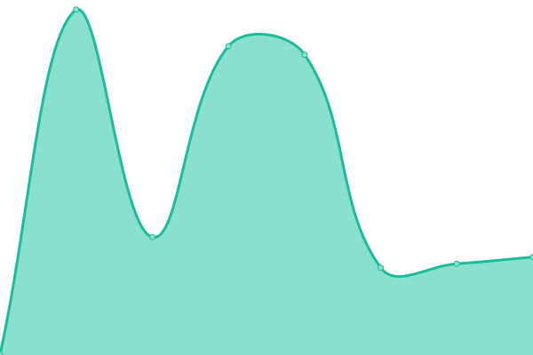

# [📈 Live Status](https://demo.upptime.js.org): <!--live status--> **🟧 Partial outage**

This repository contains the open-source uptime monitor and status page for [Aden](https://demo.upptime.js.org), powered by [Upptime](https://github.com/upptime/upptime).

With [Upptime](https://upptime.js.org), you can get your own unlimited and free uptime monitor and status page, powered entirely by a GitHub repository. We use [Issues](https://github.com/FAD-Desarollo/upptime/issues) as incident reports, [Actions](https://github.com/FAD-Desarollo/upptime/actions) as uptime monitors, and [Pages](https://demo.upptime.js.org) for the status page.

<!--start: status pages-->
<!-- This summary is generated by Upptime (https://github.com/upptime/upptime) -->
<!-- Do not edit this manually, your changes will be overwritten -->
<!-- prettier-ignore -->
| URL | Status | History | Response Time | Uptime |
| --- | ------ | ------- | ------------- | ------ |
|  [Aden](https://www.aden.org) | 🟩 Up | [aden.yml](https://github.com/FAD-Desarollo/upptime/commits/HEAD/history/aden.yml) | 

 337ms
     
 | 

<a href="https://upptime.aden.org/history/aden">98.27%</a>
    

|  [Acropolis](https://app.aden.org/) | 🟩 Up | [acropolis.yml](https://github.com/FAD-Desarollo/upptime/commits/HEAD/history/acropolis.yml) | 

 254ms
     
 | 

<a href="https://upptime.aden.org/history/acropolis">100.00%</a>
    

|  [CRM Old](https://ocrm.aden.org/web) | 🟥 Down | [crm-old.yml](https://github.com/FAD-Desarollo/upptime/commits/HEAD/history/crm-old.yml) | 

 0ms
     
 | 

<a href="https://upptime.aden.org/history/crm-old">0.00%</a>
    

|  [CRM New](https://crm.internal.aden.org/web) | 🟩 Up | [crm-new.yml](https://github.com/FAD-Desarollo/upptime/commits/HEAD/history/crm-new.yml) | 

 827ms
     
 | 

<a href="https://upptime.aden.org/history/crm-new">99.80%</a>
    

|  [SIS Api](https://sisapi.aden.org/api/v1/acropolis/test) | 🟩 Up | [sis-api.yml](https://github.com/FAD-Desarollo/upptime/commits/HEAD/history/sis-api.yml) | 

 561ms
     
 | 

<a href="https://upptime.aden.org/history/sis-api">99.26%</a>
    

|  [SIS](https://www.aden.org/sis/login) | 🟩 Up | [sis.yml](https://github.com/FAD-Desarollo/upptime/commits/HEAD/history/sis.yml) | 

 644ms
     
 | 

<a href="https://upptime.aden.org/history/sis">99.40%</a>
    

|  [SIS sede 1510](https://www.aden.org/sis/sede/1510) | 🟩 Up | [sis-sede-1510.yml](https://github.com/FAD-Desarollo/upptime/commits/HEAD/history/sis-sede-1510.yml) | 

 210ms
     
 | 

<a href="https://upptime.aden.org/history/sis-sede-1510">100.00%</a>
    

|  [FusionAuth](https://fa.aden.org/) | 🟩 Up | [fusion-auth.yml](https://github.com/FAD-Desarollo/upptime/commits/HEAD/history/fusion-auth.yml) | 

 324ms
     
 | 

<a href="https://upptime.aden.org/history/fusion-auth">100.00%</a>
    

|  [Repositorio](https://repositorio.aden.org/) | 🟩 Up | [repositorio.yml](https://github.com/FAD-Desarollo/upptime/commits/HEAD/history/repositorio.yml) | 

 1802ms
     
 | 

<a href="https://upptime.aden.org/history/repositorio">99.17%</a>
    

|  [Repositorio-api](https://repositorio-api.aden.org/docs) | 🟩 Up | [repositorio-api.yml](https://github.com/FAD-Desarollo/upptime/commits/HEAD/history/repositorio-api.yml) | 

 289ms
     
 | 

<a href="https://upptime.aden.org/history/repositorio-api">99.79%</a>
    

|  [Ucontact](https://aden.ucontactcloud.com/) | 🟩 Up | [ucontact.yml](https://github.com/FAD-Desarollo/upptime/commits/HEAD/history/ucontact.yml) | 

 284ms
     
 | 

<a href="https://upptime.aden.org/history/ucontact">100.00%</a>
    

|  [Adenuniversity](https://adenuniversity.edu.pa/) | 🟩 Up | [adenuniversity.yml](https://github.com/FAD-Desarollo/upptime/commits/HEAD/history/adenuniversity.yml) | 

 416ms
     
 | 

<a href="https://upptime.aden.org/history/adenuniversity">100.00%</a>
    

|  [Adenuniversity Precios](https://adenuniversity.edu.pa/precios-panama/) | 🟩 Up | [adenuniversity-precios.yml](https://github.com/FAD-Desarollo/upptime/commits/HEAD/history/adenuniversity-precios.yml) | 

 235ms
     
 | 

<a href="https://upptime.aden.org/history/adenuniversity-precios">100.00%</a>
    

|  [Adenuniversity Mkt Landings](https://mkt-landings.adenuniversity.edu.pa/) | 🟩 Up | [adenuniversity-mkt-landings.yml](https://github.com/FAD-Desarollo/upptime/commits/HEAD/history/adenuniversity-mkt-landings.yml) | 

 468ms
     
 | 

<a href="https://upptime.aden.org/history/adenuniversity-mkt-landings">100.00%</a>
    

<!--end: status pages-->

[**Visit our status website →**](https://fad-desarollo.github.io/upptime/)

## 📄 License

- Powered by: [Upptime](https://github.com/upptime/upptime)
- Code: [MIT](./LICENSE) © [Aden](https://demo.upptime.js.org)
- Data in the `./history` directory: [Open Database License](https://opendatacommons.org/licenses/odbl/1-0/)
